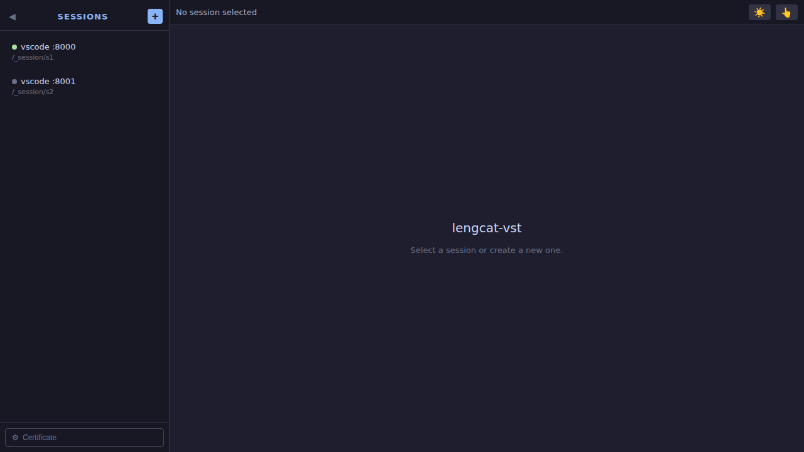
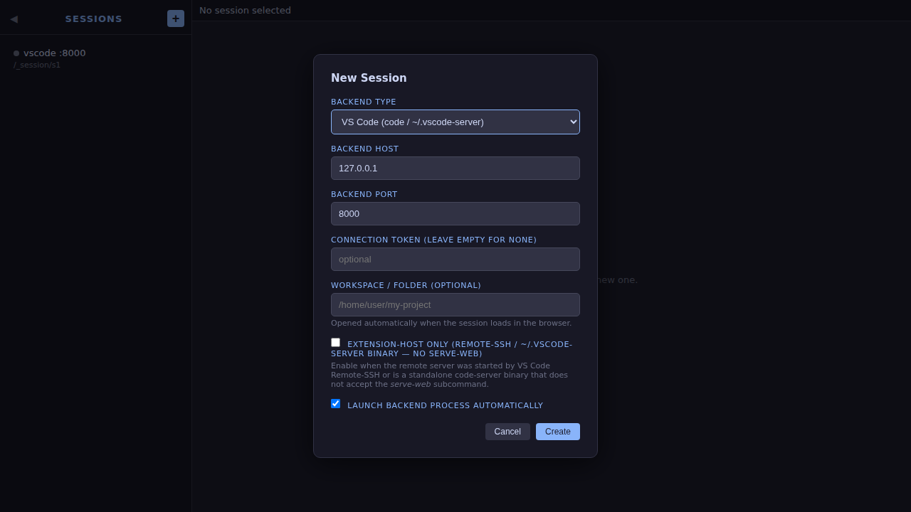

# lengcat-vst

A private local **HTTPS** reverse proxy that gives your browser a secure context for VS Code web servers (`serve-web` mode) — no cloud tunnel required.

Powered by [code-server](https://github.com/coder/code-server): if no VS Code binary is found on `PATH`, the proxy **automatically downloads and starts** the VS Code server for you (~49 MB, cached for reuse).

## Features

- **HTTPS by default** — the proxy auto-generates a self-signed TLS certificate and serves over `https://` + `wss://` so the browser grants a [secure context](https://developer.mozilla.org/en-US/docs/Web/Security/Secure_Contexts) (required by clipboard, camera, and many VS Code extensions). Disable with `--no-https` if needed.
- **Built-in session dashboard** — opening `https://127.0.0.1:3000` shows a full session manager UI with a collapsible sidebar; no extra tool required.
- **Built-in leduo-patrol session** — on startup, lengcat-vst also tries to launch one [dream-north/leduo-patrol](https://github.com/dream-north/leduo-patrol) instance and pins it to the top of the dashboard session list (`/_leduo-patrol`).
- **Launch with folder** — the *Launch* button opens a dialog where you can type the workspace folder to open in VS Code before the session starts.
- **Auto-launch backends** — pass `--launch` and the proxy starts the VS Code server for you; if the binary isn't on `PATH` it automatically falls back to the `~/.vscode-server` home-directory installation, and if that's not found either it **auto-downloads** the VS Code server from the [code-server](https://github.com/coder/code-server) npm package (~49 MB, cached in `$TMPDIR/lengcat-vst-vscode-server`) so you never have to install it manually.
- **Extension-host-only mode** — connect to a VS Code server that was started by Remote SSH (or any server that doesn't need the `serve-web` subcommand) by ticking the *Extension-host only* checkbox or passing `--extension-host-only`.
- **Workspace folder** — specify a workspace path at session-create or launch time; the proxy appends it as a `?folder=` query parameter when loading VS Code in the iframe.
- **Reverse HTTP + WebSocket proxy** — all traffic (including the extension-host WebSocket) is forwarded transparently; `X-Frame-Options` and restrictive CSP `frame-ancestors` headers are stripped so VS Code loads cleanly inside iframes.
- **Multi-instance support** — run several VS Code instances behind a single proxy port, each at its own URL path prefix.
- **Collapsible sidebar** — click ◀ to collapse the session list to status-dot-only view; the state is remembered across page reloads.
- **Optional proxy authentication** — protect the proxy with a Bearer token.
- **No public internet exposure** — the proxy only listens on `127.0.0.1` by default.

---

## Quick start

```bash
# Install
npm install -g lengcat-vst

# Launch a VS Code backend automatically (HTTPS is on by default)
# If 'code' is not on PATH, the VS Code server is auto-downloaded (~49 MB)
lengcat-vst --backend-port 8000 --launch

# Open https://127.0.0.1:3000 — accept the self-signed cert warning once
```

By default, the bundled leduo-patrol session is started from:

```bash
~/.lengcat-vst/leduo-patrol
```

If your clone lives elsewhere, set:

```bash
LEDUO_PATROL_DIR=/absolute/path/to/leduo-patrol lengcat-vst --backend-port 8000 --launch
```

To use a fixed leduo-patrol access key (so the dashboard iframe opens directly
without manually pasting the key), set either:

```bash
LEDUO_PATROL_ACCESS_KEY=your-fixed-key lengcat-vst --backend-port 8000 --launch
# or
lengcat-vst --backend-port 8000 --launch --leduo-access-key your-fixed-key
```

If neither is set, `lengcat-vst` generates a per-run key and passes it to
leduo-patrol automatically.

> **First-time browser warning**: because the certificate is self-signed, your browser will show a security warning. Click *Advanced → Proceed* (Chrome/Edge) or *Accept the Risk* (Firefox) once. After that, the proxy works like any HTTPS site — and VS Code extensions get the secure context they need.

Or, start the backend yourself and disable HTTPS if you prefer plain HTTP:

```bash
# Start the VS Code backend manually
code serve-web --host 127.0.0.1 --port 8000 --without-connection-token

# Proxy without HTTPS
lengcat-vst --backend-port 8000 --no-https
```

---

## UI tour

### Dashboard — session sidebar (collapsible)

The sidebar lists every registered session with a colour-coded status dot.  
Click **◀** to collapse it to dots-only. State is saved across reloads.  
Click **+** to add a new session, or select an existing one.



### New Session dialog

Click **+** in the sidebar header to open the New Session dialog.



Fields available:
- **Backend type** — `vscode` or `custom` (with custom executable path).
- **Backend host / port** — where the VS Code server is listening.
- **Connection token** — optional; leave blank for `--without-connection-token` servers.
- **Workspace / folder** — default folder to open on every launch.
- **Extension-host only** — enable when the remote server was started by VS Code Remote-SSH (no `serve-web` subcommand).
- **Launch backend automatically** — spawn the VS Code process when creating the session.

### Launch with folder

Click **Launch** on a stopped session — a dialog appears where you can type the workspace/folder path.  
Leave it empty to use the path set when the session was created.

---

## HTTPS details

### Self-signed certificate (default)

The first time the proxy starts with `--https` (the default), it generates an RSA key pair and a self-signed certificate valid for one year. The files are cached in:

```
$TMPDIR/lengcat-vst-tls/cert.pem
$TMPDIR/lengcat-vst-tls/key.pem
```

The certificate covers `localhost` and `127.0.0.1` as Subject Alternative Names.

### Bring your own certificate

```bash
lengcat-vst --tls-cert /path/to/cert.pem --tls-key /path/to/key.pem
```

The proxy will use your certificate instead of auto-generating one.

### Disable HTTPS

```bash
lengcat-vst --no-https
```

---

## Extension-host-only / Remote-SSH servers

When VS Code Remote SSH connects to a machine it installs a server under `~/.vscode-server/bin/<hash>/bin/code-server`. That binary is the server itself — it does **not** accept a `serve-web` subcommand.

Enable **Extension-host only** mode so lengcat-vst skips the subcommand:

```bash
# Via CLI
lengcat-vst --backend-port 8080 --extension-host-only

# Via dashboard: tick "Extension-host only" in the New Session dialog
```

If the primary binary (`code`) is not found on `PATH`, the proxy automatically looks for a server binary in the home directory:

| Search path |
|------------|
| `~/.vscode-server/cli/servers/Stable-*/server/bin/code-server` |
| `~/.vscode-server/bin/*/bin/code-server` (legacy Remote-SSH layout) |

If neither the PATH binary nor a home-directory installation is found, the proxy **automatically downloads** the VS Code server bundled in the [code-server](https://github.com/coder/code-server) npm package (≈49 MB) and caches it in `$TMPDIR/lengcat-vst-vscode-server`.  The download runs only once; all subsequent starts use the cache.

---

## Multi-instance routing

Start two VS Code backends on different ports **with different base paths**:

```bash
code serve-web --host 127.0.0.1 --port 8001 --server-base-path /instance/1 --without-connection-token
code serve-web --host 127.0.0.1 --port 8002 --server-base-path /instance/2 --without-connection-token
```

Create a JSON config file (`config.json`):

```json
{
  "host": "127.0.0.1",
  "port": 3000,
  "backends": [
    { "type": "vscode", "host": "127.0.0.1", "port": 8001, "tls": false, "tokenSource": "none", "pathPrefix": "/instance/1" },
    { "type": "vscode", "host": "127.0.0.1", "port": 8002, "tls": false, "tokenSource": "none", "pathPrefix": "/instance/2" }
  ]
}
```

```bash
lengcat-vst --config config.json
```

Open `https://127.0.0.1:3000` — the dashboard shows both sessions. Direct URLs:

- `https://127.0.0.1:3000/instance/1` → editor 1
- `https://127.0.0.1:3000/instance/2` → editor 2

---

## CLI reference

```
lengcat-vst [options]

Options:
  --config <path>            Path to JSON config file
  --port <port>              Local proxy listen port         (default: 3000)
  --host <host>              Local proxy bind address        (default: 127.0.0.1)
  --backend-type <type>      vscode | custom                 (default: vscode)
  --backend-host <host>      Backend server host             (default: localhost)
  --backend-port <port>      Backend server port
  --path-prefix <prefix>     URL path prefix for multi-instance routing
  --token <secret>           Enable proxy auth with this secret token
  --backend-token <token>    Fixed connection token for the VS Code backend
  --folder <path>            Default workspace folder (appended as ?folder=…)
  --extension-host-only      Skip the serve-web subcommand (Remote-SSH style)
  --https                    Serve over HTTPS/WSS — on by default
  --no-https                 Disable HTTPS (plain HTTP)
  --tls-cert <path>          Path to TLS certificate PEM    (auto-generated if absent)
  --tls-key <path>           Path to TLS private-key PEM   (auto-generated if absent)
  --leduo-access-key <key>   Fixed access key for leduo-patrol
  --launch                   Auto-start each configured backend on startup
```

---

## Configuration file schema

All fields are optional; missing values fall back to defaults.

```jsonc
{
  "host": "127.0.0.1",      // proxy bind address
  "port": 3000,             // proxy listen port
  "auth": false,            // require a proxy token?
  "proxySecret": "",        // token required when auth=true
  "https": true,            // serve over HTTPS (self-signed cert if no tlsCert/tlsKey)
  "tlsCert": "",            // path to TLS certificate PEM
  "tlsKey": "",             // path to TLS private-key PEM
  "backends": [
    {
      "type": "vscode",        // vscode | custom
      "host": "localhost",
      "port": 8000,
      "tls": false,
      "tokenSource": "none",   // none | fixed | auto
      "token": "",             // used when tokenSource=fixed
      "executable": "",        // used when type=custom
      "pathPrefix": "/instance/1",   // enables multi-instance routing
      "folder": "/home/user/project", // default workspace folder
      "extensionHostOnly": false      // skip serve-web subcommand
    }
  ]
}
```

Default ports by backend type:

| Type | Default port |
|------|-------------|
| `vscode` | 8000 |
| `custom` | 8000 |

---

## Troubleshooting

### Browser shows "Your connection is not private"

This is expected for the auto-generated self-signed certificate.  
Click *Advanced → Proceed* once. To avoid this permanently, add `$TMPDIR/lengcat-vst-tls/cert.pem` to your OS / browser trust store.

### VS Code extensions can't access clipboard / camera / microphone

These require a [secure context](https://developer.mozilla.org/en-US/docs/Web/Security/Secure_Contexts) (`https://`). Make sure HTTPS is enabled (it is by default). If you're using `--no-https`, switch back.

### WebSocket error 1006 / "workbench failed to connect"

- Ensure the VS Code backend is actually running on the configured port.
- If you used `--no-https`, the browser may block mixed-content WebSocket upgrades on some networks — re-enable HTTPS.
- For extension-host-only servers (Remote-SSH), tick **Extension-host only** or use `--extension-host-only`.

### `Error: spawn code ENOENT`

The VS Code `code` binary is not on your `PATH`.  lengcat-vst will automatically try these fallbacks before giving up:

1. `~/.vscode-server` home-directory installation (set by Remote-SSH), and
2. **Auto-download**: the VS Code server is downloaded from the [code-server](https://github.com/coder/code-server) npm package (~49 MB) and cached in `$TMPDIR/lengcat-vst-vscode-server`.

If you still want to use your own installation: add the binary to `PATH` (e.g. `export PATH="$PATH:/usr/share/code/bin"`) or use `--backend-type custom --backend-type /full/path/to/code`.

---

## Development

```bash
# Install dependencies
npm install

# Build TypeScript
npm run build

# Run unit tests (Jest — fast, no browser)
npm test

# Run integration tests (Playwright — downloads ~49 MB VS Code server on first run)
npm run test:e2e -- tests/integration.spec.ts
```

### Test architecture

| Test file | What it covers | Speed |
|-----------|---------------|-------|
| `tests/*.test.ts` | Unit tests: config, auth, session manager, server routing, proxy header fixups, HTTPS server, UI HTML | Fast |
| `tests/ui.spec.ts` | Playwright: mock backends, proxy auth, multi-instance routing, dashboard screenshots | Fast |
| `tests/integration.spec.ts` | E2E with a real VS Code server: HTTP proxy, HTTPS proxy + IP access, multi-instance routing, VS Code workbench visible (`.monaco-workbench`), session dashboard iframe | First run ~2 min |

Integration test suites:

| Suite | Description |
|-------|-------------|
| **Single VS Code instance** | HTTP proxy, HTML shell + WebSocket, no 502s |
| **Multi-instance routing** | Two VS Code servers, correct `serverBasePath` per instance, simultaneous iframes |
| **HTTPS + IP access** | `https://127.0.0.1:PORT`, `isHttps=true`, `.monaco-workbench` rendered, WSS error-free, screenshots saved to `test-results/` |
| **Session dashboard** | Dashboard lists sessions, iframe loads VS Code via path prefix, screenshots |

The VS Code server used in integration tests (and the auto-download fallback in production) comes from the [`code-server`](https://github.com/coder/code-server) npm package via `src/download.ts` and is cached in `$TMPDIR/lengcat-vst-vscode-server` after the first download.
